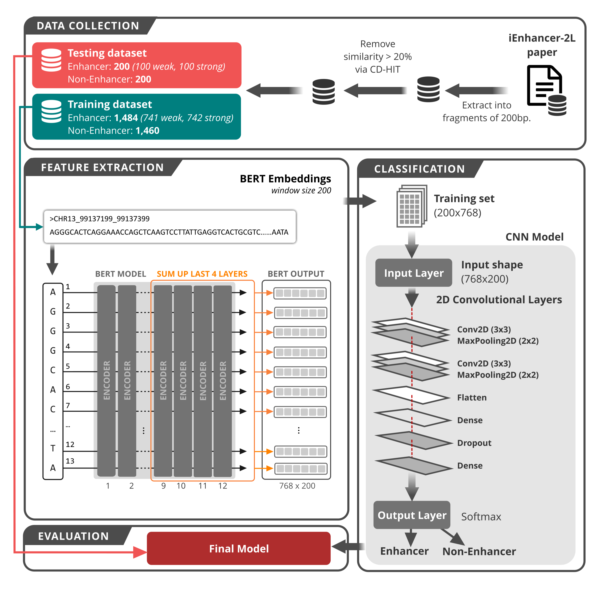

# Bert-Enhancer
A Transformer Architecture Based on BERT and 2D Convolutional Neural Network to Identify DNA Enhancers from Sequence Information

Recently, language representation models have drawn a lot of attention in natural language processing (NLP) field due to their remarkable results. Among them, Bidirectional Encoder Representations from Transformers (BERT) has proven to be a simple, yet powerful language model that achieved novel state-of-the-art performance. BERT adopted the concept of contextualized word embedding to capture the semantics and context of the words in which they appeared. In this study, we present a novel technique by incorporating BERT-base multilingual model in computational biology to interpret the information of DNA sequences. We treated DNA sequences as sentences and transformed them into fixed-length meaningful vectors where 768- vector represents each nucleotide. As a case study, we applied our method on DNA enhancer prediction, which is a well-known and challenging problem in this field. We then observed that our BERT-base features improved more than 5-10% in terms of sensitivity, specificity, accuracy, and MCC compared to the current state-of-the-art features in bioinformatics. Moreover, advanced experiments show that deep learning (as represented by 2D convolutional neural networks) hold potential in learning BERT features better than other traditional machine learning techniques. In conclusion, we suggest that BERT and 2D convolutional neural networks could open a new avenue in biological modeling using sequence information.

## Step by step for training model
### Step 1
Use "run_create_pretraining_512_base.py" file for pre-trained BERT
### Step 2
Use "bert2json.txt" to extract BERT features as JSON files
### Step 3
Use "jsonl2csv.py" to convert JSON to CSV files
### Step 4
Use "2D_CNN.py" to train 2D CNN model from generated CSV files
